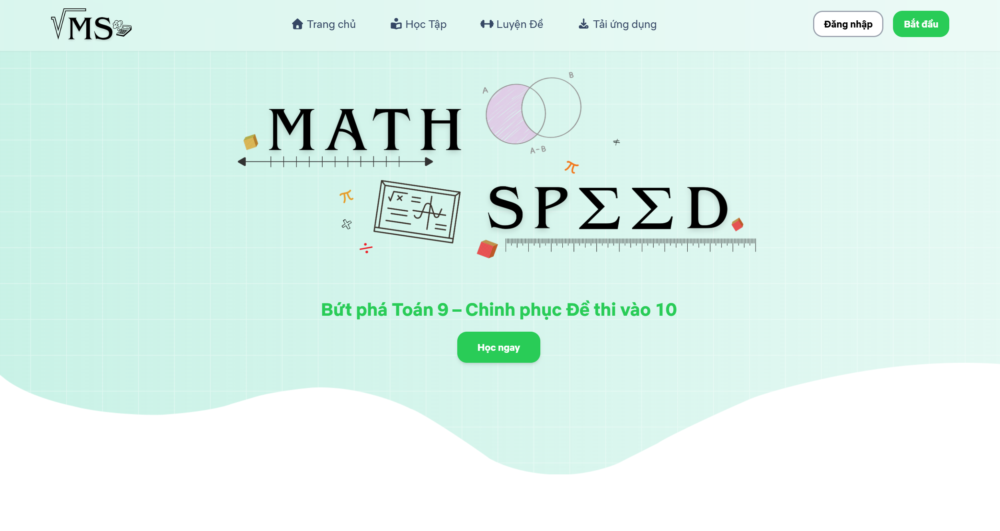

<p>&nbsp;</p>
<p align="center">
  
<p />

<p align="center">
  
  
</p>

<p align="center">
  <b>Buid With</b>
</p>

<p align="center">
  
  
  
  
  
  
</p>
<p align="center">⭐ Star me on GitHub — your support motivates me a lot! (´▽`ʃ♡ƪ)</p>

---

## ➡️ [Demo Here](https://math-speed-be.onrender.com/)

## 📌 Table of Contents
* [💫 About](#about)
* [✨ Features](#feature)
  * [📚 Structured Learning System](#movie-tv-show)
  * [🎯 Practice Test System](#search)
  * [✅ Auto-Grading & Instant Feedback](#detail)
  * [📊 Test History & Statistics](#watch)
  * [👤 User Management](#responsive)
  * [🛠️ Admin Dashboard](#admin)
  * [📱 Progressive Web App (PWA)](#pwa)
* [📦 Installation & Setup](#setup)
* [✍️ Author](#author)
* [📜 License](#license)

## <a id="about"></a>💫 About ECV
<p>
  
  
  <strong>Math Speed</strong> is a comprehensive online learning platform designed specifically for Year 9 pupils, aimed at supporting their revision and preparation for the Year 10 Mathematics entrance exam. The project was launched with the aim of digitising the traditional learning process, transforming revision from a tedious task into a more engaging and effective experience through modern web technology.

  With a wealth of knowledge organised into 32 mathematical topics, categorised by level from basic to advanced, alongside a feature for practising randomised multiple-choice tests comprising 20 questions drawn from a question bank, Math Speed offers a comprehensive, scientific and effective revision solution. Notably, the app is optimised to run on all devices, from computers to mobile phones, and supports PWA (Progressive Web App), allowing it to be installed directly in phone.
</p>

## <a id="feature"></a> ✨ Features

### <a id="movie-tv-show"></a> 📚 Structured Learning System
- 32 mathematical topics organized into 3 progressive difficulty levels (Basic, Intermediate, Advanced)
- Interactive theory lessons with HTML-formatted mathematical formulas
- Automatic progress tracking and level advancement
### <a id="search"></a> 🎯 Practice Test System
- Randomized 20-question multiple-choice tests from question bank
- Customizable timer options (15, 45, 60, 120 minutes, or up to 360 minutes)
- Real-time countdown timer during exams
### <a id="detail"></a> ✅ Auto-Grading & Instant Feedback
- Automatic scoring immediately after submission
- Detailed explanations for correct/incorrect answers with HTML support
- Audio feedback effects for right/wrong answers
### <a id="watch"></a> 📊 Test History & Statistics
- omplete exam history with date, score, and duration
- Personal statistics: Total attempts, average score, highest score
- Review past test results with detailed breakdown
### <a id="responsive"></a> 👤 User Management
- Secure registration/login with JWT authentication
- Role-based access control (User/Admin)
- Progress saving tied to individual accounts
### <a id="admin"></a> 🛠️ Admin Dashboard
- Full CRUD operations for question bank management
- Organize questions by topic and difficulty level
- Add detailed explanations for each question
### <a id="pwa"></a> 📱 Progressive Web App (PWA)
- Fully responsive design across all devices
- Installable as native app on mobile devices
- Download Android APK version available
- Offline-ready with Service Worker support

## <a id="setup"></a> 📦 Installation & Setup

Follow these instructions to get a copy of the project up and running on your local machine for development and testing purposes.

### <a id="prer"></a> 📋 Prerequisites
Before you begin, ensure you have the following installed:
* [Git](https://git-scm.com/)
* [Node.js](https://nodejs.org/) (v18.0.0 or higher recommended) & (npm/bun)

### 📥 Clone the Repository
```bash
git clone git@github.com:lhnhidev/math-speed-for-student-app.git
```

Create a `.env` file in the directory with the following content:
```bash
# Server Configuration
PORT=3000

# Database
MONGO_URI=your_mongodb_connection_string

# Authentication
JWT_SECRET=your_jwt_secret_key_here
```

You can use `bun` rather than `npm` to run the project.
``` bash
# Start app
# Via the local URL provided in your terminal http://localhost:5173
bun run dev
```

**Note:** Replace your_mongodb_connection_string with your actual MongoDB connection string (e.g., mongodb://localhost:27017/mathspeed for local or MongoDB Atlas URI for cloud)

Install Dependencies
```bash
# Using npm
npm install

# Or using Bun (faster alternative)
bun install
```

Seed the Database
```bash
# Using npm
npm run seed

# Or using Bun
bun run seed
```

Start the Development Server
```bash
# Using npm
npm run dev

# Or using Bun
bun run dev
```

### 🎉 Result

The server will start at http://localhost:3000 (or the PORT specified in your .env file)
<br/>
If configured successfully, after about 1-3 minutes, you will see an interface like this:



## <a id="contributing"></a> 🤝 Contributing

Contributions are what make the open-source community such an amazing place to learn, inspire, and create. Any contributions you make are **greatly appreciated**.

If you have a suggestion that would make this better, please fork the repo and create a pull request. You can also simply open an issue with the tag "enhancement".

1. Fork the Project
2. Create your Feature Branch (git checkout -b feature/amazing-feature)
3. Commit your Changes using Conventional Commits format
```bash
git commit -m '<type>(<scope>): <description>'
```
4. Push to the Branch (git push origin feature/amazing-feature)
5. Open a Pull Request

## <a id="author"></a> ✍️ Author


Le Hoang Nhi - Initial work & Lead Developer - @lhnhidev

You can also connect with me via [LinkedIn](https://www.linkedin.com/in/nhi-l%C3%AA-021188324/) or lhnhi420@gmail.com

## <a id="license"></a>  📜 License
Distributed under the MIT License. See [LICENSE](./LICENSE) file in the repository for more information.

## <a id="feedback"></a> 💖 Feedback & Support

If you love using this project, please consider giving me a star on GitHub! ⭐

- Found a bug? Open an Issue on my repository.

- Have a feature request? I would love to hear it! Start a Discussion or drop an issue.

- Want to contribute? I welcome PRs!

---

<div align="center">
  
</div>

<p align="center">✨ Your feedback and stars help keep this project growing ✨</p>